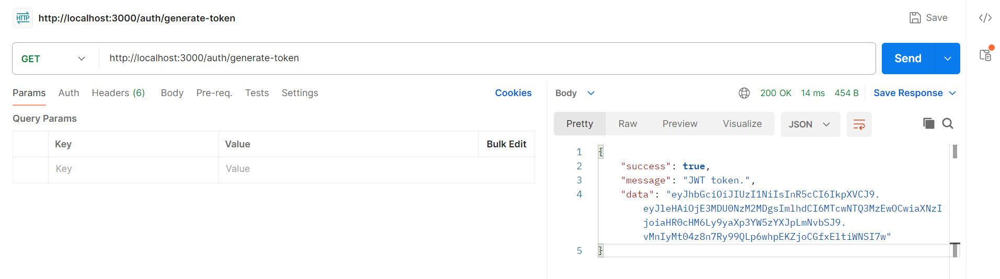
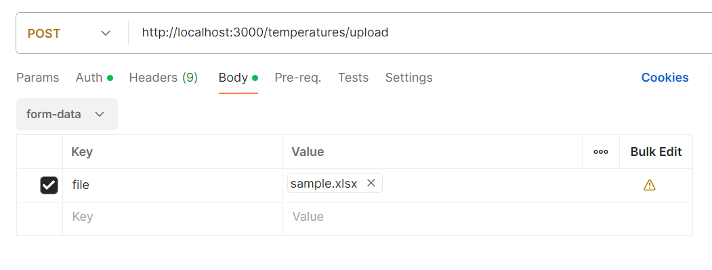
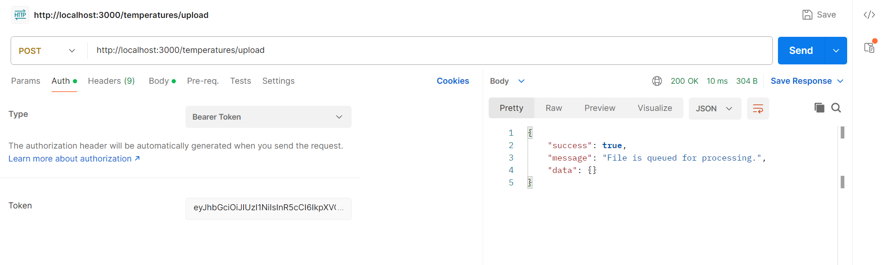
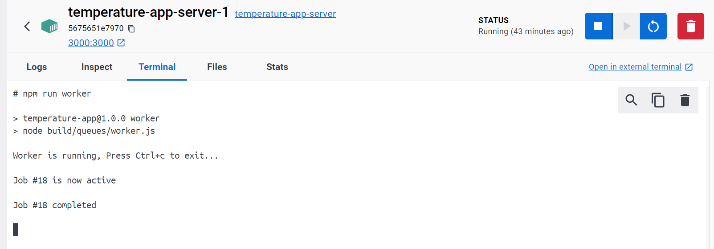
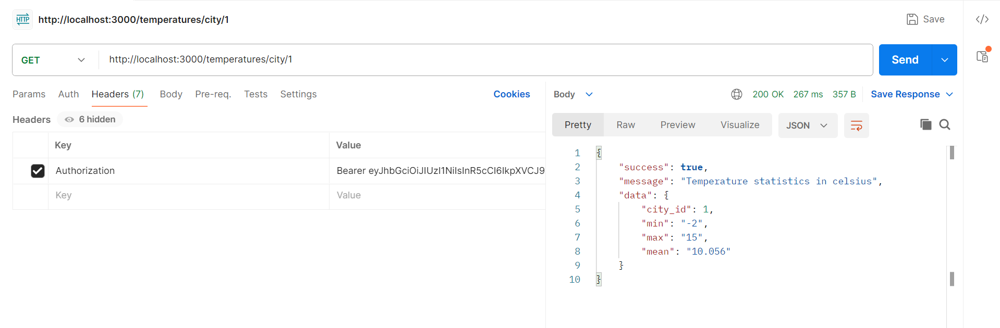

# Temperature App

## To run the app please follow the instructions.

### Prerequisites:

- Docker
- Docker Compose tool

---

### Instructions:

> - Create `.env` file and add the environment variables

> - run `docker compose -f docker-compose.prod.yml build`
>
> Above command will build images defined in `docker-compose.prod.yml` file.

> - run `docker compose -f docker-compose.prod.yml up`
>
> Above command will start the services defined in `docker-compose.prod.yml` file. We will see three containers running namely `server`, `db` and `redis`.

> - run `docker exec temperature-app-server-1 npm run worker`
>
> Above command will execute in the docker container and start the worker to process the queues.

---

### Available Routes:

> - `/auth/generate-token`
>
> Use above route to get JWT token
>
> 

> - `/temperatures/upload`
>
> Use above route to bulk insert temperature data. This route will add the task in the queue for processing. Queue will retry the failed job for specified number of times exponentially.
>
> Note: At the time the app only supports `.xlsx` file containing `city_id`, `temp`, `timestamp` columns, [Download Sample File](./public/readme/sample.xlsx).
> Upload file as form-data.
>
> 
>
> 
>
> Queue Worker
>
> 

> - `/temperatures/city/{city_id}`
>
>  Use above route to get the temperature statistics from the cache table for the specified city id.
>
> 
>
> Note: Please add JWT token in the authorization header as `Bearer Token` for the last two routes.

> The application has not been tested for large file sizes due to a lack of extensive data. There are opportunities for numerous optimizations, improvements and in error handling.
